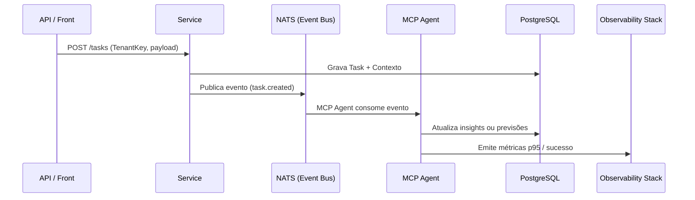
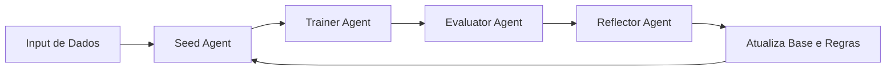

# 🏗️ MCP-Ultra — Arquitetura e Fluxo Operacional

## 📘 Visão Geral

O **MCP-Ultra** segue a arquitetura **Clean + Event-Driven**, com foco em modularidade, observabilidade e escalabilidade.  
Cada módulo é autônomo, comunicando-se por eventos **NATS JetStream** e integrando agentes de IA via **MCP (Model Context Protocol)**.

---

## 🧱 Camadas Principais

```mermaid
graph TD
    A[Entradas Externas] --> B[Handlers / API Gateway]
    B --> C[Services (Domínio MCP)]
    C --> D[Repository / Persistência]
    C --> E[Event Bus (NATS JetStream)]
    E --> F[Agents MCP (Seed / Trainer / Evaluator / Reflector)]
    F --> G[Observability: Prometheus / Grafana / Jaeger]
    F --> H[Compliance / Security Layer]
    G --> I[DevOps / CI-CD]
```

### 1️⃣ Handlers (Interface de Entrada)
- Responsáveis por HTTP APIs e consumo de eventos NATS.  
- Usam middlewares padronizados (auth, rate-limit, observabilidade).  
- Geram métricas automáticas de latência, erro e throughput.

### 2️⃣ Services (Domínio)
- Implementam a lógica de negócio e automação de IA.  
- Cada serviço segue o padrão **UseCase** → **Repository Interface**.  
- Integram os **MCP Agents** via SDK (`sdk/sdk-ultra-wasm`).

### 3️⃣ Repository (Infraestrutura)
- Persistência em PostgreSQL com **RLS (Row Level Security)**.  
- Cache distribuído em Redis.  
- Publica e consome eventos em NATS JetStream.

### 4️⃣ Agents (IA Cognitiva)
| Tipo | Função | Frequência |
|------|---------|-------------|
| **Seed Agent** | Inicializa contexto e instruções | No boot do tenant |
| **Trainer Agent** | Aprendizado iterativo | A cada 15 min |
| **Evaluator Agent** | Avalia qualidade e coerência | Contínuo |
| **Reflector Agent** | Reescreve e melhora comportamentos | On demand / gatilho |

---

## 🔁 Fluxo de Dados (Pipeline MCP)



---

## ⚙️ Observabilidade

- **Logs estruturados** (zerolog/zap)
- **Tracing distribuído**: OpenTelemetry → Jaeger  
- **Métricas**: Prometheus + Grafana  
- **Alertas**: baseados em SLOs do `business_config.yaml`

---

## 🧠 Inteligência e Aprendizado

O núcleo cognitivo é orientado a **ciclos de reflexão e ajuste automático**.



Cada ciclo melhora a precisão de previsão e ajusta automaticamente as ações dos agentes.

---

## 🛡️ Segurança e Compliance

- Autenticação JWT + TenantKey obrigatório.  
- LGPD-ready: `ScanForPII`, `RecordConsent`, `DataRetention`.  
- Auditoria de acessos (`compliance/audit.log`).  
- Todos os endpoints auditáveis e versionados via MCP Gateway.

---

## 🧩 Multi-Tenancy

- **Modelo:** RLS (Row Level Security) em PostgreSQL.  
- **Identificação:** `TenantKey` propagado em todos os eventos.  
- **Isolamento:** Cache e eventos segregados por Tenant.

---

## 📊 Métricas e SLOs

| Métrica | Alvo |
|----------|------|
| Latência p95 | ≤ 120 ms |
| Erro rate | ≤ 0.5 % |
| Uptime | ≥ 99.9 % |
| Cobertura testes | ≥ 80 % |
| Tempo médio por ciclo MCP | ≤ 2s |

---

## 🧩 Stack Técnica

| Componente | Tecnologia |
|-------------|-------------|
| Linguagem | Go 1.21+ |
| Mensageria | NATS JetStream |
| Banco | PostgreSQL (RLS) |
| Cache | Redis |
| Tracing | Jaeger (OpenTelemetry) |
| Métricas | Prometheus / Grafana |
| Container | Docker / Kubernetes |
| Testes | Testify / GoMock |
| CI/CD | GitHub Actions / GitLab CI |

---

## 🧭 DevOps e Deploy

```bash
# Local
docker-compose up -d postgres redis nats
go run cmd/main.go

# Build & Test
go build ./...
go test ./... -cover

# Produção (Kubernetes)
kubectl apply -f deploy/k8s/
```

---

## 🔒 Padrões de Qualidade Vertikon

- ✅ Clean Architecture / DDD  
- ✅ Observabilidade nativa  
- ✅ Segurança e LGPD integradas  
- ✅ Testes table-driven (≥80%)  
- ✅ Deploy automatizado (CI/CD)  
- ✅ Padrão PLANEJAR → EXECUTAR → VALIDAR

---

## 📘 Documentação Relacionada

- `README.md` → Guia de uso e instalação  
- `business_config.yaml` → Planos SaaS e SLOs  
- `nats-schemas/*.json` → Especificação dos eventos  
- `sdk/sdk-ultra-wasm/` → Customizações Vertikon  
- `docs/ARCHITECTURE.md` → (este documento)
